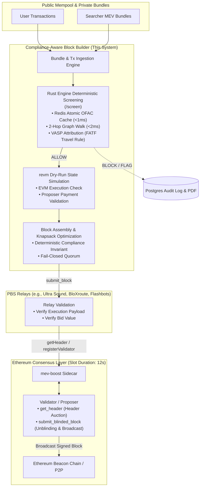

# Production Integration Guide: MEV-Boost & PBS Pipeline

This document details how the **Compliance-Aware Block Builder** integrates into the Ethereum production architecture under **Proposer-Builder Separation (PBS)** and the **MEV-Boost** specification (`ethereum/builder-specs`).

---

## 1. High-Level PBS Architecture

In post-Merge Ethereum (PoS), validators run consensus clients (Lighthouse, Prysm, Teku, etc.) connected to `mev-boost` as a local sidecar. Builders construct candidate blocks maximizing fee revenue while conforming to compliance policies, then submit block bids to independent Relays.



---

## 2. The Builder API Specification (`ethereum/builder-specs`)

To operate as a live Ethereum block builder, the builder node implements the standardized [Builder Specs REST API](https://github.com/ethereum/builder-specs):

### Key Endpoints

1. **`POST /eth/v1/builder/validators`**
   - **Trigger**: Relays register validator preferences (gas limits, fee recipient, active registrations).
   - **Compliance Action**: Proposer address is cross-referenced against the `sanctions_entities` and `address_attributions` database. If a validator is identified as an OFAC-sanctioned validator (e.g. Tornado Cash DAO validator or designated Russian entity), the block builder flags the proposer as `EXPOSED_EXTERNAL` and terminates block construction for that slot to avoid providing economic services to sanctioned actors.

2. **`GET /eth/v1/builder/header/{slot}/{parent_hash}/{pubkey}`**
   - **Trigger**: MEV-Boost requests the highest-value compliant execution payload header from the relay for slot proposal.
   - **Payload**: Contains `ExecutionPayloadHeader`, `value` (wei bid to proposer), and cryptographic builder signature.
   - **Compliance Guarantee**: The header represents a block that contains **zero transactions** directly matching OFAC SDN addresses or exceeding the institutional 2-hop exposure risk threshold.

3. **`POST /eth/v1/builder/blinded_blocks`**
   - **Trigger**: The elected validator signs the blinded block header, and MEV-Boost submits it back to the relay for unblinding.
   - **Payload**: Full `ExecutionPayload` is released to the P2P network.

---

## 3. Comparison with Existing Industry Builders

| Dimension | Flashbots Builder | bloXroute Max Profit | BeaverBuild / Titan | Compliance-Aware Block Builder |
| :--- | :--- | :--- | :--- | :--- |
| **Sanctions Filtering** | Static OFAC list filtering (US addresses only) | Configurable regional compliance (Regulated vs Max Profit) | Non-filtering (prioritizes latency & raw MEV) | **Multi-tier deterministic rule engine** (OFAC, UK HMT, EU) |
| **Multi-Hop Traversal** | None (Direct sender/recipient match only) | None | None | **Bounded 2-hop recursive SQL graph walk with distance decay (55 ➔ 25)** |
| **Entity Classification** | None | None | None | **Real-time VASP wallet attribution & Travel Rule threshold checking** |
| **Policy Flexibility** | Hardcoded US OFAC constraints | Binary switch (compliant vs uncompliant) | No compliance policy | **Policy-as-Config JSON with live hot-swap via API & WebSocket telemetry** |
| **Audit Evidence** | None (best-effort public logs) | Internal proprietary logs | None | **Cryptographically verifiable tamper-evident PDF audit reports (SHA-256 seal)** |
| **Failure Mode** | Fail-open / fallback | Fail-open | Fail-open | **Strict Fail-Closed** (503 on cache or DB disruption refuses inclusion) |

---

## 4. Latency Budget & Slot Timing

Ethereum has a **12-second slot time**. Block building occurs within a sub-second window before the slot boundary:

```
0s                  10.5s                    11.5s        12.0s
|---------------------|------------------------|------------|
  Mempool / Bundles    Block Building Auction   Validator    Slot End /
  Continuous Inflow    Cutoff (MEV-Boost Bid)   Header Sign  P2P Broadcast
```

### Millisecond Latency Budget

- **Transaction Ingestion**: ~0.5ms (async socket read)
- **Rust Screening Engine (`/screen`)**:
  - **Redis `SISMEMBER` Direct Match**: **0.15ms – 0.35ms**
  - **Entity Classification Cache**: **0.20ms**
  - **2-Hop Bounded Graph Traversal**: **1.20ms – 2.10ms** (indexed recursive CTE)
  - **Total Rust Decision Budget**: **< 3.0ms per transaction**
- **`revm` Dry-Run Simulation**: **4.0ms – 12.0ms** per candidate block
- **Total Overhead Added by Compliance**: **< 5ms**, fitting comfortably within the 200–400ms block assembly window.

---

## 5. Fail-Closed Resilience Guarantees

In financial and institutional block building, **false positives cost pennies in uncollected tips, but false negatives trigger criminal liability under OFAC regulations**.

The system enforces three fail-closed rules:
1. **Redis Cache Unavailability**: If Redis drops or connection pool times out, `/screen` returns HTTP `503 SERVICE_UNAVAILABLE`. Upstream builders immediately halt transaction inclusion.
2. **Database Outage**: If PostgreSQL is unreachable during graph walks, the transaction is rejected from the candidate block.
3. **Unverifiable Proposer**: If the proposer validator cannot be screened against the registry, candidate block construction is aborted.
